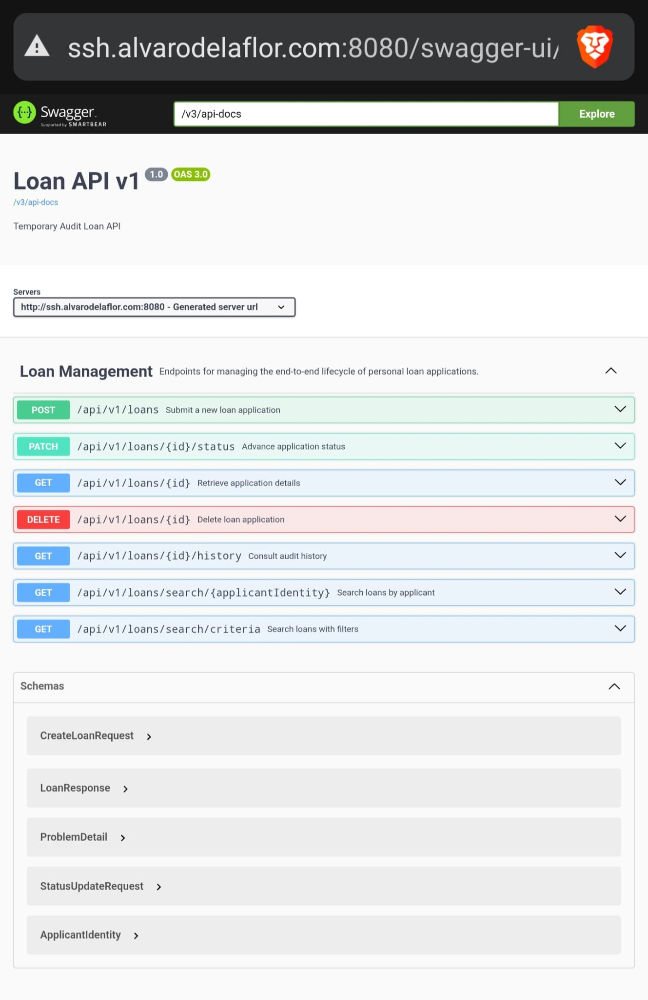

# Loan Management System (Loan API)

A REST API to manage the end-to-end lifecycle of personal loan applications (creation, retrieval, status transitions, searching and auditing). The project follows **Hexagonal Architecture (Ports & Adapters / Clean Architecture)** on **Spring Boot 3 / Java 21**, using **Oracle** as the database, **Redis** as a distributed cache, and **Hibernate Envers** for full auditability.

The API is also deployed on a personal server and can be accessed at:
- **Base URL (prod)**: `http://ssh.alvarodelaflor.com:8080`

When using Postman:
- Use **environment `CAIXABANKTECH-PROD`** (in `docs/postman/`) against the deployed server.
- Use **environment `CAIXABANKTECH-LOCAL`** for running the API locally (Docker or direct Spring Boot).

## Demo

## Quick start
- **100% test coverage achieved**
- Start everything (Oracle + Redis + API): `docker-compose up --build`
- Swagger UI (local): http://localhost:8080/swagger-ui/index.html#/
- Swagger UI (prod): http://ssh.alvarodelaflor.com:8080/swagger-ui/index.html#/
- Postman collection to run the full flow end-to-end: `docs/postman/CAIXABANKTECH.postman_collection.json`

> **Disclaimer**: depending on the browser and security settings, requests to non-HTTPS URLs (like `http://localhost:8080` or `http://ssh.alvarodelaflor.com:8080`) may be blocked for embedded content such as Swagger UI. If Swagger does not load correctly, try using a different browser, adjusting mixed-content settings, or accessing the API directly via Postman/cURL.

---

## 1) Running the project

### Prerequisites
- **Docker + Docker Compose** (recommended)
- **Java 21 + Maven 3.9+** (only if you want to run the app outside Docker)

### Docker (recommended)

#### Oracle + API (main environment)
Start Oracle (container), Redis (container) and the API:

- Normal start:
  - `docker-compose -f docker-compose.yaml up --build`

- Clean start (removes previous DB volume/state):
  - `docker-compose -f docker-compose.yaml down -v --remove-orphans && docker-compose -f docker-compose.yaml up --build`

Notes:
- First boot can take ~1–2 minutes while Oracle initializes and Flyway runs migrations.
- `docker-compose.yaml` exposes:
  - API on **8080**
  - Redis on **6379**
  - Java debug port on **8081**

#### Raspberry Pi / lightweight environment (H2 in Oracle compatibility mode)
To run the same API on a Raspberry Pi (or any low-resource environment) without starting Oracle, a second compose file is provided that uses **H2 in Oracle compatibility mode** embedded in the application:

- File: `docker-compose-raspberry.yaml`
- Services:
  - `app` (container `loan-api-h2`)
    - Exposes:
      - API on **8080**
      - Debug port on **8081**
    - Important env vars:
      - `SPRING_PROFILES_ACTIVE=h2-oracle` → activates the profile defined in `application.yml` that configures H2 to behave like Oracle.

How to start on a Raspberry Pi (or any host with Docker):

- Normal start:
  - `docker-compose -f docker-compose-raspberry.yaml up --build`

Notes:
- No external database container is started: H2 runs embedded inside the API container.
- The `h2-oracle` profile in `application.yml` configures:
  - H2 URL: `jdbc:h2:./data/loan-db;MODE=Oracle;DATABASE_TO_LOWER=TRUE;DEFAULT_NULL_ORDERING=HIGH;AUTO_SERVER=TRUE`
  - Driver: `org.h2.Driver`
  - `spring.jpa.hibernate.ddl-auto=update`
  - `spring.flyway.enabled=false` (Flyway migrations are designed for a real Oracle database).

---

## 2) API access & documentation

- **Base URL (local)**: `http://localhost:8080/api/v1/loans`
- **Base URL (prod)**: `http://ssh.alvarodelaflor.com:8080/api/v1/loans`
- **Swagger UI (local)**: http://localhost:8080/swagger-ui/index.html#/
- **Swagger UI (prod)**: http://ssh.alvarodelaflor.com:8080/swagger-ui/index.html#/

### Main endpoints
- `POST /api/v1/loans` — create a loan application (initial status `PENDING`)
- `GET /api/v1/loans/{id}` — retrieve by UUID
- `PATCH /api/v1/loans/{id}/status` — status transition (`APPROVED`, `REJECTED`, `CANCELLED`)
- `GET /api/v1/loans/{id}/history` — audit/history (Envers)
- `GET /api/v1/loans/search/{applicantIdentity}` — search by DNI/NIE
- `GET /api/v1/loans/search/criteria` — search by optional filters (DNI/NIE and/or date range)
- `DELETE /api/v1/loans/{id}` — delete a loan application by UUID

Errors:
- The API returns errors following **RFC 7807 (Problem Details)**.

---

## 3) Postman collection (run everything end-to-end)

Under `docs/postman/` you have:
- **Collection**: `CAIXABANKTECH.postman_collection.json`
- **Local environment**: `CAIXABANKTECH-LOCAL.postman_environment.json`
- **Prod environment**: `CAIXABANKTECH-PROD.postman_environment.json`

The collection is designed to run the full workflow:
1. **POST Create Loan**
2. **GET Retrieve Loan by ID**
3. **GET Retrieve Loan by ApplicantIdentity**
4. **GET Retrieve Loan by Criteria**
5. **PATCH Approve / Reject / Cancel**
6. **GET Loan History**

The first request (**Create Loan**) includes a test script that automatically stores these environment values for subsequent requests:
- `id`
- `applicantIdentity`
- `createdAt`
- `modifiedAt`

### How to use
1. Import the **collection** and the **environment** in Postman.
2. Select:
   - `CAIXABANKTECH-LOCAL` to hit `http://localhost:8080`.
   - `CAIXABANKTECH-PROD` to hit `http://ssh.alvarodelaflor.com:8080`.
3. Ensure the `caixabanktech-url` variable matches the chosen environment (including scheme, e.g. `http://ssh.alvarodelaflor.com:8080`).
4. Run the collection using the Postman **Runner** to execute all requests in order.

---

## 4) Architecture & technical decisions

This project is designed following **Hexagonal Architecture (Ports & Adapters / Clean Architecture)** to keep domain logic independent from frameworks, databases, and delivery mechanisms.

### Hexagonal Architecture
- **Domain layer (`domain/`)**
  - Contains the core business model:
    - Aggregate root: `LoanApplication`.
    - Value Objects: `ApplicantIdentity`, `LoanAmount`, `LoanId`, `LoanStatus`.
  - Enforces invariants and valid state transitions at the model level (e.g. which transitions between loan statuses are allowed).
  - Defines **ports** as Java interfaces under `domain/port/`:
    - **Inbound ports** (`port.in`): describe use cases the application exposes (e.g. creating a loan, changing status, searching loans).
    - **Outbound ports** (`port.out`): describe what the domain needs from the outside world (e.g. persistence operations for loans).
  - Domain-specific exceptions live here as well (e.g. `InvalidStateTransitionException`, `ResourceNotFoundException`).

- **Application layer (`application/`)**
  - Implements use cases by orchestrating domain objects and outbound ports.
  - Example: `LoanApplicationService` wires together validation, state transitions on `LoanApplication`, repository access through `LoanRepositoryPort`, and error handling.
  - Contains business workflows ("what to do" to satisfy a request) but delegates core rules to the domain model.

- **Infrastructure layer (`infrastructure/adapter/`)**
  - Provides concrete adapters for the external world:
    - **Persistence Adapter (`output.persistence`)**: Implementation using Spring Data JPA and Hibernate Envers for Oracle.
    - **Cache Adapter (`output.persistence.jpa.CachingLoanRepositoryAdapter`)**: Implements a caching strategy using **Redis**. It acts as a Decorator for the main Persistence Adapter to provide:
      - **Read-through**: Search in Redis before hitting the database.
      - **Write-through/Invalidation**: Automatic cache update/eviction on `save` and `delete` operations.
      - **Resilience**: Fallback to database if Redis is unavailable.
    - **Input Adapters (`input.rest`)**: REST controllers using Spring Web.
  - Uses **MapStruct** to map between DTOs, domain models, and JPA entities, avoiding manual mapping.
  - This layer is where frameworks and technical details live (Spring MVC, JPA, Envers, Flyway, Docker, etc.), keeping the domain pure.

### Key technical decisions
- **Relational database with Oracle as primary target**
  - Oracle is used to mimic a realistic banking environment.
  - A dedicated Oracle container is defined in `docker-compose.yaml`.
  - SQL schema is managed by Flyway using Oracle-specific migrations under `src/main/resources/db/migration/`.

- **Auditability with Hibernate Envers**
  - Every change to `LoanApplication` is versioned using Envers.
  - A custom revision entity (`AuditRevisionEntity`) keeps audit metadata in a `REVINFO` table.
  - The persistence adapter exposes a `findHistory` use case so clients can retrieve the full status history of a loan.

- **Schema versioning with Flyway**
  - Flyway runs automatically on startup in the Oracle profile, applying migrations incrementally.
  - This guarantees reproducible schemas across environments and easy upgrades.

- **DTO ↔ Domain ↔ JPA mapping with MapStruct**
  - MapStruct is used as a compile-time code generator to map between API DTOs, domain models, and JPA entities.
  - This avoids reflection-based mappers and keeps mapping logic explicit and type-safe.

- **Multiple Spring profiles for different environments**
  - `oracle` / `default`:
    - Connects to the Oracle container.
    - Enables Flyway migrations.
    - Uses the Oracle Hibernate dialect.
  - `h2-oracle`:
    - Uses H2 in **Oracle compatibility mode** for lightweight environments (e.g. Raspberry Pi).
    - Disables Flyway (migrations are tailored for Oracle).
    - Still uses JPA/Hibernate so the rest of the stack behaves the same.

- **Containerised runtime with Docker Compose**
  - `docker-compose.yaml` runs Oracle + the API together.
  - `docker-compose-raspberry.yaml` runs only the API with an embedded H2 database for lower-resource hosts.
  - Both compose files expose the API on port `8080` and a debug port on `8081` for remote debugging.

---

## 5) Testing (100% coverage)
- **Unit tests for the domain layer**
  - Verify invariants, value object behaviour, and valid/invalid state transitions in `LoanApplication` and related types.
- **Service/application tests**
  - `LoanApplicationService` is covered with tests that exercise happy paths and error conditions (missing resources, invalid transitions, empty search results, etc.).
- **MVC/controller tests**
  - Validate HTTP contracts, status codes, validation errors, and RFC 7807 Problem Details responses.

Test coverage is intentionally kept at **100%** to guard against regressions, especially around status transitions and business rules that are critical in a loan domain.

---

## 6) Possible improvements

These are directions the project could evolve while still fitting the existing hexagonal architecture.

- **Security and authentication**
  - Introduce Spring Security with OAuth2/JWT.
  - Separate roles (e.g. customer vs back-office operator) and restrict which status transitions each role can invoke.
  - Keep security concerns at the adapter level so the domain stays framework-agnostic.

- **Observability**
  - Add Micrometer + Prometheus to collect metrics for key use cases (requests per endpoint, loan creations per status, error rates, latency, etc.).
  - Integrate with a dashboard (Grafana) to monitor system health and usage patterns over time.

- **Asynchronous processing and events**
  - Publish domain events (e.g. `LoanApproved`, `LoanRejected`, `LoanCancelled`) to a message broker like Kafka.
  - Allow other systems (notifications, risk engines, reporting) to subscribe without coupling them directly to this API.

- **Multi-database support**
  - Extend the existing profiles to fully support another relational database (e.g. PostgreSQL) with its own migrations and dialect.
  - Ensure mappings and schemas remain portable, so the same domain can run against different RDBMS backends.

- **API hardening**
  - Further enrich the OpenAPI/Swagger documentation with examples, detailed descriptions, and error schemas.
  - Provide additional Postman environments (staging, QA) and CI/CD integration for automated tests and deployments.

---

### Disclaimer
*Developed by @alvarodelaflor*
